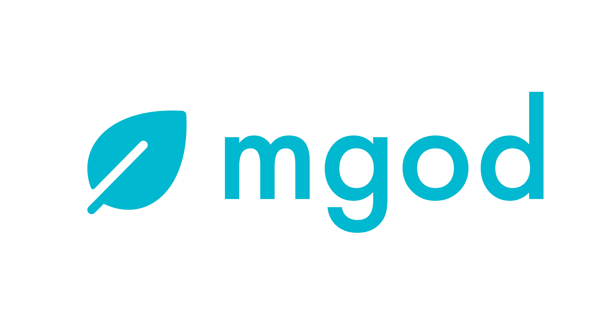

<!-- prettier-ignore-start -->
<!-- markdownlint-disable-next-line MD041 -->

<!-- prettier-ignore-end -->

# mgod

`mgod` is a MongoDB ODM specifically designed for Go. It provides a structured way to map Go models to MongoDB collections, simplifying database interactions in Go applications.

## Features
- Reuse existing Go structs to define models and perform Mongo operations.
- Automatic field transformation between Go and MongoDB using struct tags.
- Easily manage meta fields in models without cluttering Go structs.
- Supports union types, expanding data capabilities.
- Implement strict field requirements with struct tags for data integrity.
- Wrapper around the official Mongo Go Driver.

## Requirements
- Go 1.18 or higher.
- MongoDB 3.6 and higher.

## Installation
```
go get github.com/Lyearn/mgod
```

## Basic Usage
```go
// Step 1: Add tags (wherever required) in existing struct.
type User struct {
	Name     string
	EmailID  string `bson:"emailId"`
	Age      *int32 `bson:",omitempty"`
	JoinedOn string `bson:"joinedOn" mgoType:"date"`
}

// Step 2: Use mgod to get the entity odm.
model := User{}
schemaOpts := schemaopt.SchemaOptions{
	Collection: "users",
	Timestamps: true,
}

// dbConn is the database connection obtained using Go Mongo Driver's Connect method.
userModelOpts := mgod.NewEntityMongoOptions(dbConn).SetSchemaOptions(schemaOpts)
userModel, _ := mgod.NewEntityMongoModel(model, *userModelOpts)

// Step 3: Use the above odm to perform CRUD operations with ease.
joinedOn, _ := dateformatter.New(time.Now()).GetISOString()
userDoc := User{
	Name: "Gopher",
	EmailID: "gopher@mgod.com",
	JoinedOn: joinedOn,
}
userModel.InsertOne(context.TODO(), userDoc)
/*
{
	"_id": ObjectId("65697705d4cbed00e8aba717"),
	"name": "Gopher",
	"emailId": "gopher@mgod.com",
	"joinedOn": "2023-12-01 11:32:19.290Z",
	"createdAt": "2023-12-01 11:32:19.290Z",
	"__v": 0
}
*/

// Find data using model properties.
users, _ := userModel.Find(context.TODO(), bson.M{"name": userDoc.Name})
/*
[]User{
	User{
		Name: "Gopher",
		EmailID: "gopher@mgod.com",
		JoinedOn: "2023-12-01T11:32:19.290Z",
	}
}
*/
```

## Motivation
Creating `mgod` was driven by the need to simplify MongoDB interactions in Go. Traditionally, working with MongoDB in Go involved either using separate structs for database and service logic or manually converting service structs to MongoDB documents, a process that was both time-consuming and error-prone. This lack of integration often led to redundant coding, especially when dealing with union types or adding meta fields for each MongoDB operation.

Inspired by the easy interface of MongoDB handling using [Mongoose](https://github.com/Automattic/mongoose) and [Typegoose](https://github.com/typegoose/typegoose) libraries available in Typescript, `mgod` aims to streamline these processes. It offers a more integrated approach, reducing the need for repetitive code and enhancing type safety, making MongoDB operations more intuitive and efficient in Go.

## Future Scope
The current version of mgod is a stable release. However, there are plans to add a lot more features like -
- [ ] Enable functionality to opt out of the default conversion of date fields to ISOString format.
- [ ] Implement a setup step for storing a default Mongo connection, eliminating the need to pass it during EntityMongoModel creation.
- [ ] Provide support for transactions following the integration of default Mongo connection logic.
- [ ] Develop easy to use wrapper functions around MongoDB Aggregation operation.
- [ ] Introduce automatic MongoDB collection selection based on Go struct names as a default behavior.
- [ ] Add test cases to improve code coverage.

If you have any interesting feature requests, feel free to open an issue on GitHub. We will be more than happy to discuss that!

<!-- ## Documentation -->

## License
`mgod` is licensed under the [MIT License](https://github.com/Lyearn/mgod/blob/main/LICENSE).
